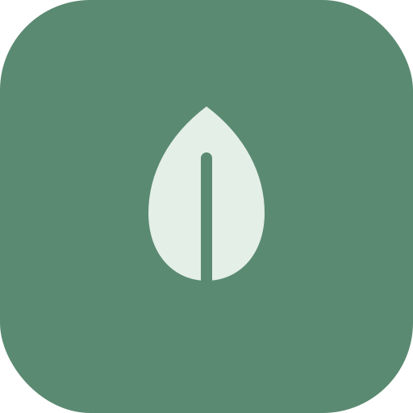
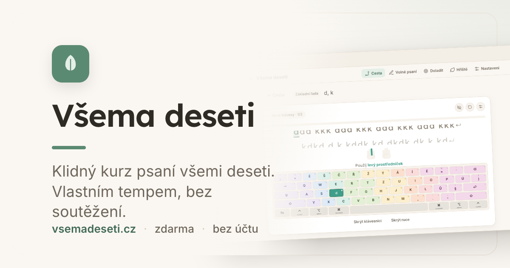
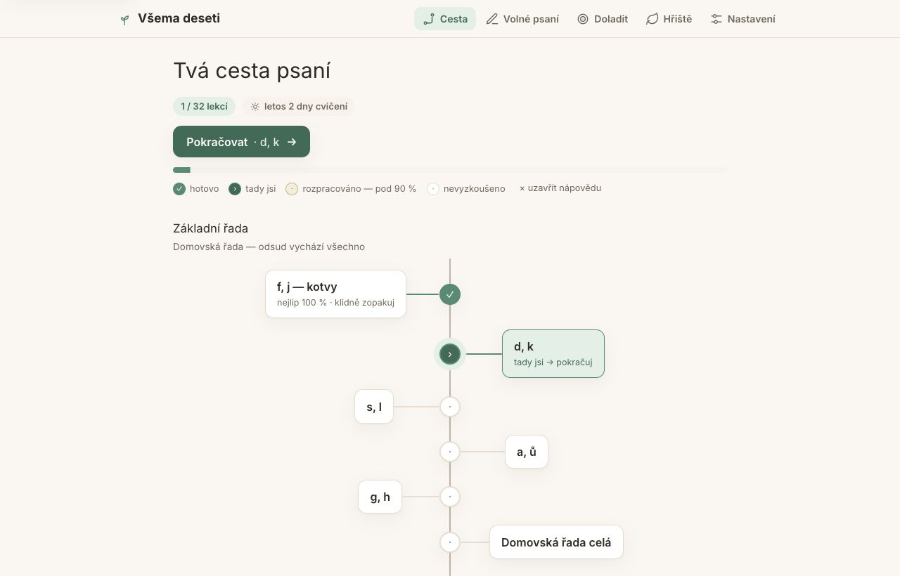
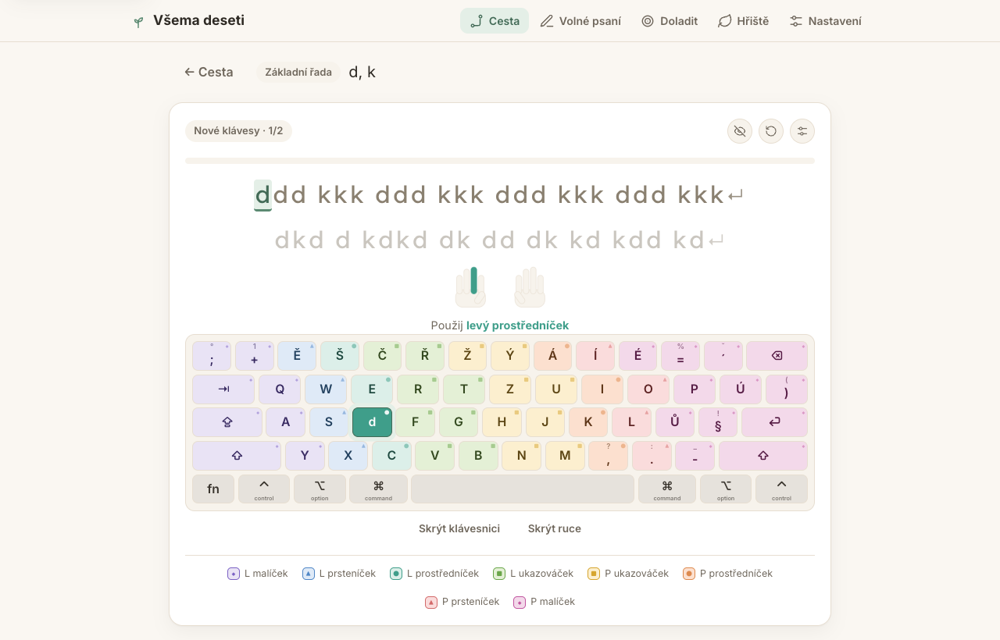
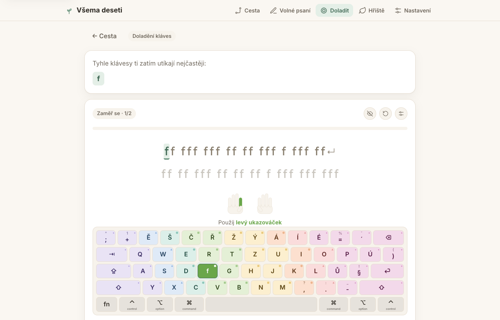
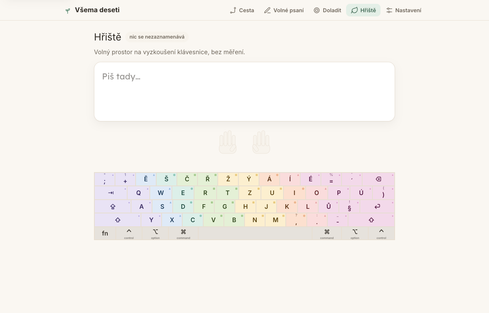

<div align="center">



# Všema deseti

**A calm, local-first touch-typing trainer for Czech (QWERTZ).**
For all ages, self-paced. Positively motivating, never competitive —
no leaderboards, no ranks, no punishing red.

[**vsemadeseti.cz →**](https://vsemadeseti.cz)  ·  free  ·  runs in the browser, no account



</div>

---

Progress is measured against your own past self, not against other people. The
interface behaves like a patient teacher seated beside you: it points to the right
key, never raises its voice, and when you stumble it leans in with a warm nudge —
a gentle ochre cue, never a red mark. Polished enough for an adult, unintimidating
for a child; the two audiences share one calm register.

See [`SPEC.md`](./SPEC.md) for the full product decisions and [`DESIGN.md`](./DESIGN.md)
for the design system.

## Screenshots

|  |  |
| :--: | :--: |
| **Cesta** — your typing path | **Lekce** — a lesson in progress |
|  |  |
| **Doladit** — drills for your weakest keys | **Hřiště** — a no-tracking playground |
|  |  |

The on-screen keyboard is color-coded by finger (each zone has a hue **and** a glyph
badge, so it stays readable for color-blind users) and highlights the next key to press.

## Privacy

**100 % local. No account, no servers, no analytics, no third-party requests —
nothing you type ever leaves your device.** Progress lives in a local SQLite
database in your browser; the recovery phrase exists only so *you* can move your
data to another device. (If cross-device sync ever ships, it will be opt-in.)

## Modes

- **Cesta** — the structured course (a soft-suggested path; nothing is locked)
- **Volné psaní** — type a provided passage or paste your own text
- **Doladit** — targeted drills built from your most-missed keys
- **Hřiště** — a relaxed playground with finger guides and zero tracking

## Stack

- **React 19 + Vite + TypeScript**
- **[Evolu](https://www.evolu.dev) 7** — local-first SQLite (OPFS) in the browser;
  data is local by default (`transports: []`), portable via a recovery phrase.
- **Tailwind v4** (design tokens) + a little **Framer Motion**
- Zero backend. Installable **PWA** — a Workbox service worker
  ([`vite-plugin-pwa`](https://vite-pwa-org.netlify.app)) precaches the app shell
  (incl. the SQLite WASM + Evolu workers), so it boots fully **offline**.

## Develop

```bash
npm install
npm run dev        # http://localhost:5173
npm run build      # type-check + production build
npm run typecheck
```

## How it works

- **Curriculum** (`src/data/curriculum.ts`) — 7 stages, ~32 lessons, built from
  per-key drills → bigrams → real Czech words → calm phrases. Content is generated
  deterministically and filtered to keys learned so far.
- **Layout** (`src/data/layout.ts`) — the Czech QWERTZ key map + 10-finger
  assignment. Input is matched on the *produced character*; the on-screen keyboard
  is rendered from this table.
- **Typing engine** (`src/engine/useTypingSession.ts`) — reads `beforeinput` (not
  raw keydown) so **Czech dead keys compose correctly** (´+o → ó arrives as one
  insertText). Block-on-error or flow-through (a setting).
- **Progress** lives in Evolu (`src/db/`); device preferences (theme, sound,
  scaffolding) live in `localStorage` (`src/ui/settings.ts`).

## Accessibility

Color-blind-safe finger coding (hue **+** glyph badge), dark/light/system themes,
adjustable text size, an optional monospace practice font, and an optional
**dyslexia-friendly font** ([OpenDyslexic](https://opendyslexic.org)) that restyles
the whole app — self-hosted so it works offline.

## Status / not yet done

See the "Open / deferred" section of [`SPEC.md`](./SPEC.md) and the notes in code:
live cross-device sync (currently local-only + recovery-phrase restore),
English/other layouts, and the full Czech corpus. (The QWERTZ layout table,
incl. punctuation and dead keys, is verified against CLDR — see
`src/data/layout.ts`.)

## Credits

- **[OpenDyslexic](https://opendyslexic.org)** by Abelardo Gonzalez — self-hosted in
  [`public/fonts/`](./public/fonts) and used for the optional dyslexia-friendly mode.
  Licensed under **CC-BY 3.0** (original fonts © Bitstream); see
  [`public/fonts/OpenDyslexic-LICENSE.txt`](./public/fonts/OpenDyslexic-LICENSE.txt).
- **Inter** and **Lexend** (UI / drill text) — self-hosted in
  [`public/fonts/`](./public/fonts) (latin + latin-ext subsets, variable woff2),
  both under the SIL Open Font License 1.1; see
  [`public/fonts/Inter-Lexend-LICENSE.txt`](./public/fonts/Inter-Lexend-LICENSE.txt).
- **JetBrains Mono** (optional monospace practice font) — self-hosted in
  [`public/fonts/`](./public/fonts) under the SIL Open Font License 1.1; see
  [`public/fonts/JetBrainsMono-LICENSE.txt`](./public/fonts/JetBrainsMono-LICENSE.txt).

## License

See [`LICENSE`](./LICENSE).
